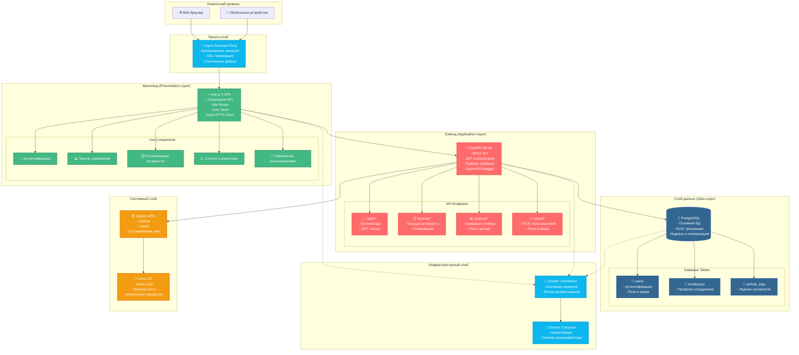
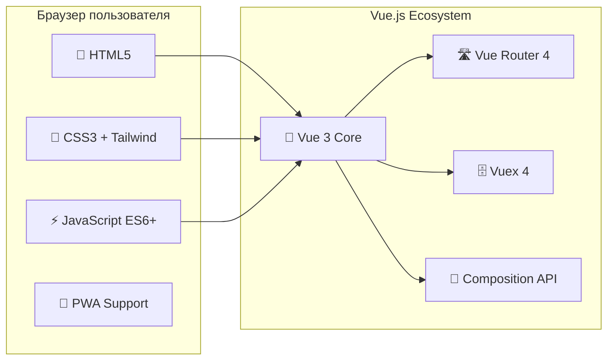
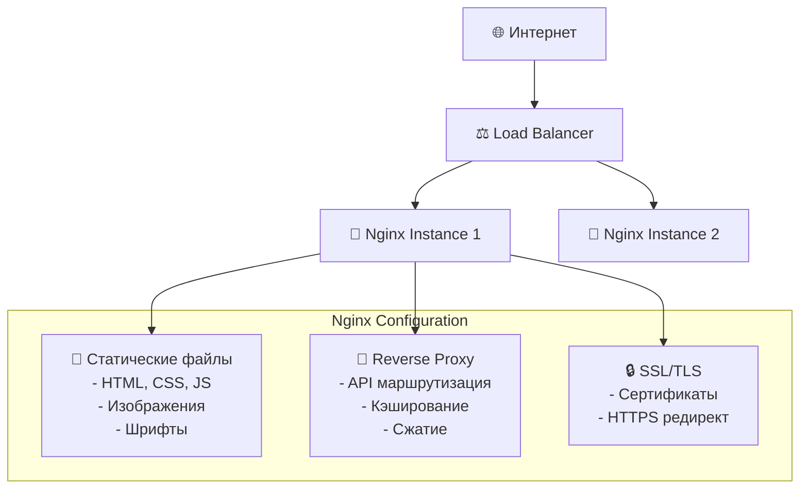
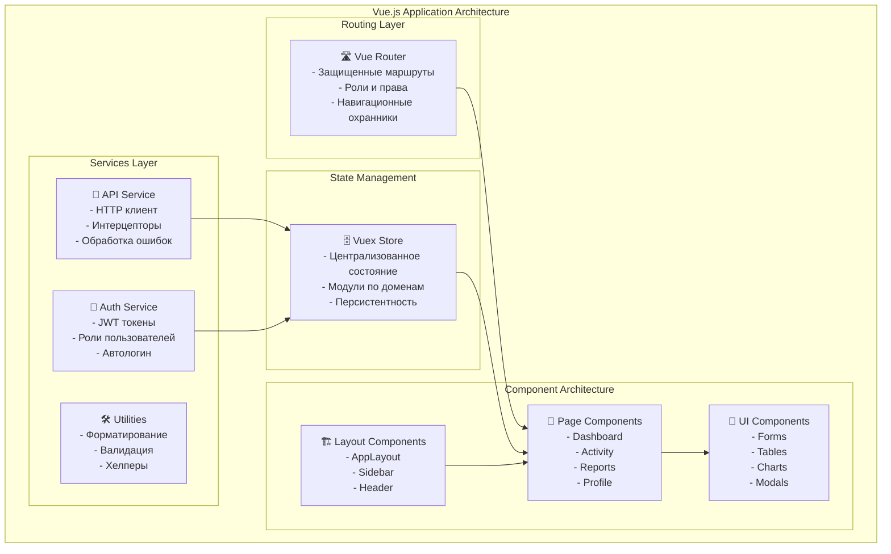
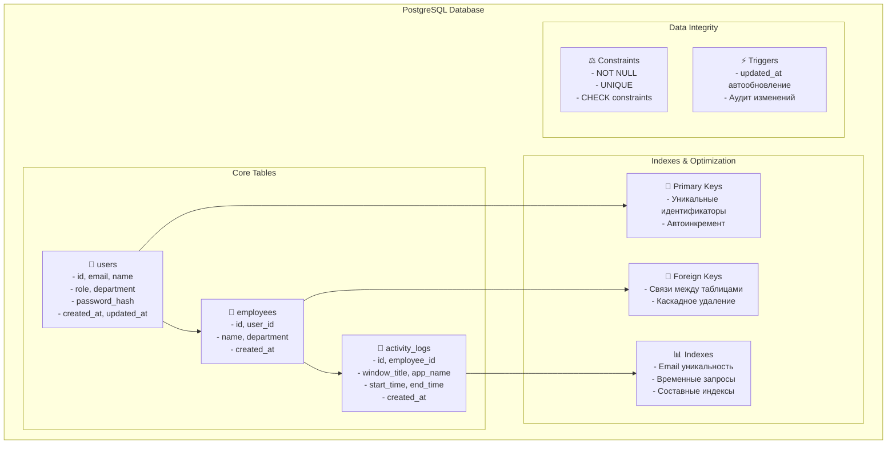
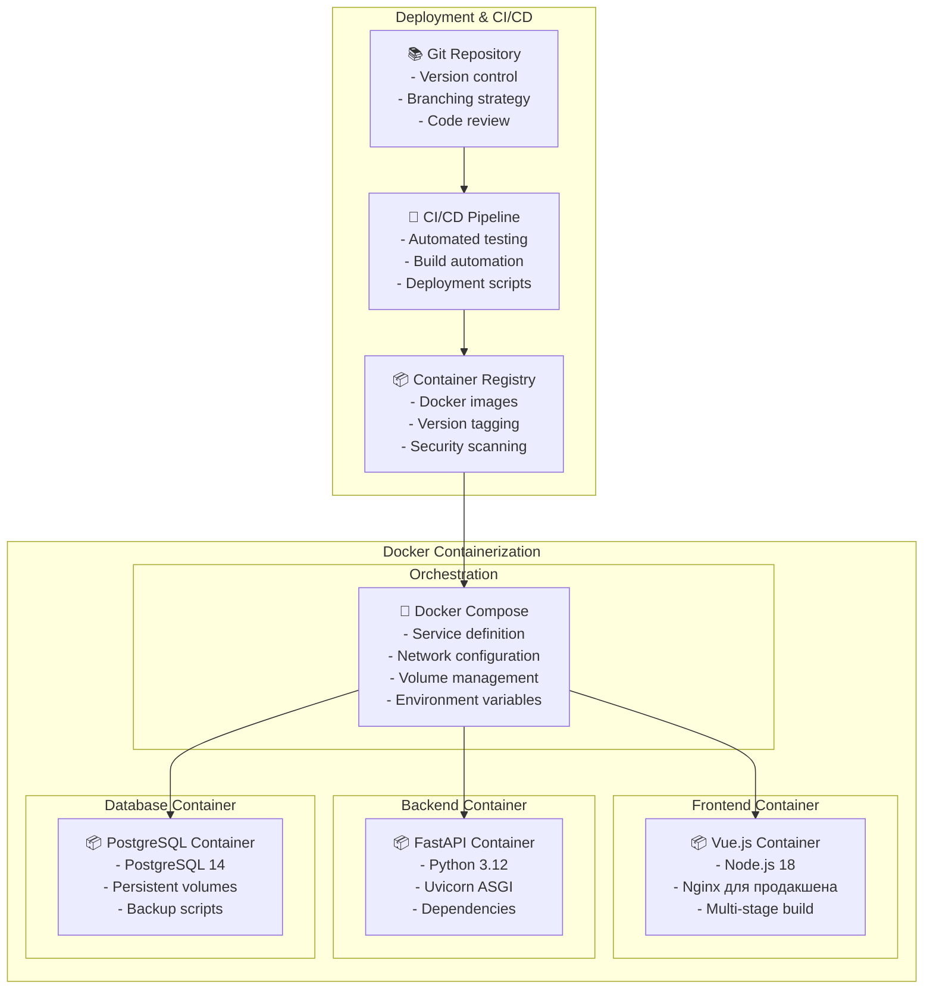
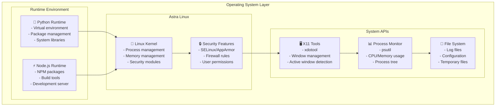
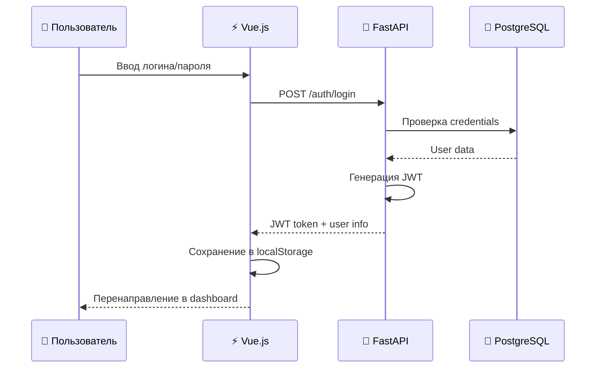
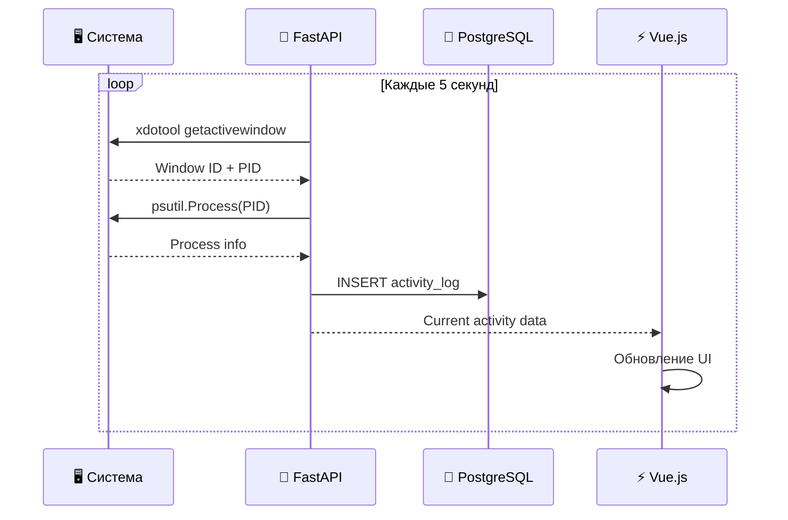
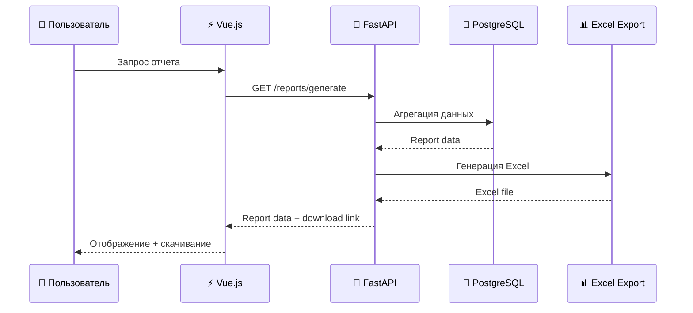

# Архитектурная схема проекта Employee Time Tracking

## Общая архитектурная диаграмма



## Детальная архитектура по слоям

### 1. Клиентский слой (Client Layer)



**Технологии и особенности:**
- **Vue.js 3** с Composition API для реактивности
- **Vue Router** для SPA навигации
- **Vuex** для управления состоянием
- **Axios** для HTTP запросов
- **LocalStorage** для кэширования данных
- **Responsive Design** для мобильных устройств

### 2. Прокси-слой (Proxy Layer)



**Функции Nginx:**
- Обслуживание статических файлов
- Reverse proxy для API запросов
- SSL терминация
- Сжатие gzip/brotli
- Кэширование статического контента
- Балансировка нагрузки

### 3. Фронтенд слой (Frontend Layer)



**Ключевые компоненты:**

#### Компоненты представления:
- **AppLayout** - основной макет с сайдбаром
- **ActivityTracker** - отслеживание активности в реальном времени
- **ActivityStats** - статистика и аналитика
- **ReportGenerator** - генерация отчетов
- **UserProfile** - профиль пользователя
- **EmployeeList** - управление сотрудниками

#### Управление состоянием:
- **auth module** - аутентификация и авторизация
- **activity module** - данные активности
- **reports module** - отчеты и статистика

### 4. Бэкенд слой (Backend Layer)

```mermaid
graph TB
    subgraph "FastAPI Application"
        subgraph "API Layer"
            Endpoints[🔗 REST Endpoints<br/>- OpenAPI/Swagger<br/>- Автодокументация<br/>- Валидация запросов]
        end
        
        subgraph "Authentication & Authorization"
            JWT[🔑 JWT Authentication<br/>- Токены доступа<br/>- Refresh токены<br/>- Роли и права]
            OAuth[🔐 OAuth2 Flow<br/>- Password flow<br/>- Scopes<br/>- Middleware]
        end
        
        subgraph "Business Logic"
            Services[⚙️ Service Layer<br/>- Бизнес-логика<br/>- Валидация данных<br/>- Обработка ошибок]
            
            ActivityService[📊 Activity Service<br/>- Отслеживание окон<br/>- Логирование активности<br/>- Системные вызовы]
            
            ReportService[📈 Report Service<br/>- Генерация отчетов<br/>- Excel экспорт<br/>- Агрегация данных]
            
            UserService[👤 User Service<br/>- CRUD операции<br/>- Управление ролями<br/>- Хеширование паролей]
        end
        
        subgraph "Data Access Layer"
            ORM[🗃️ SQLAlchemy ORM<br/>- Модели данных<br/>- Миграции<br/>- Связи между таблицами]
            
            Models[📋 Data Models<br/>- User<br/>- Employee<br/>- ActivityLog]
        end
        
        subgraph "External Integrations"
            SystemAPI[⚙️ System APIs<br/>- xdotool (Linux)<br/>- psutil<br/>- Мониторинг процессов]
            
            FileExport[📁 File Export<br/>- Excel генерация<br/>- PDF отчеты<br/>- CSV экспорт]
        end
    end
    
    Endpoints --> JWT
    Endpoints --> Services
    Services --> ActivityService
    Services --> ReportService
    Services --> UserService
    Services --> ORM
    ORM --> Models
    ActivityService --> SystemAPI
    ReportService --> FileExport
```

**API Endpoints структура:**

```
/api/v1/
├── auth/
│   ├── POST /login          # Аутентификация
│   ├── POST /logout         # Выход
│   └── POST /refresh        # Обновление токена
├── users/
│   ├── GET /users           # Список пользователей
│   ├── POST /users          # Создание пользователя
│   ├── GET /users/{id}      # Профиль пользователя
│   └── PUT /users/{id}      # Обновление профиля
├── activity/
│   ├── GET /current         # Текущая активность
│   ├── POST /start          # Начало отслеживания
│   ├── POST /stop           # Остановка отслеживания
│   └── GET /history         # История активности
├── reports/
│   ├── GET /generate        # Генерация отчета
│   ├── GET /export/excel    # Excel экспорт
│   └── GET /stats           # Статистика
└── employees/
    ├── GET /employees       # Список сотрудников
    └── GET /employees/{id}  # Детали сотрудника
```

### 5. Слой данных (Data Layer)



**Особенности базы данных:**
- **ACID транзакции** для целостности данных
- **Индексы** для оптимизации запросов
- **Партиционирование** activity_logs по времени
- **Backup стратегия** с регулярными снимками
- **Репликация** для высокой доступности

### 6. Инфраструктурный слой (Infrastructure Layer)



**Docker Compose конфигурация:**
```yaml
services:
  frontend:    # Vue.js приложение
  backend:     # FastAPI сервер
  database:    # PostgreSQL
  nginx:       # Reverse proxy
```

### 7. Системный слой (System Layer)



## Потоки данных и взаимодействие

### 1. Поток аутентификации



### 2. Поток отслеживания активности



### 3. Поток генерации отчетов



## Безопасность и производительность

### Безопасность
- **JWT токены** с коротким временем жизни
- **Хеширование паролей** через bcrypt
- **Роли и права доступа** (RBAC)
- **CORS настройки** для API
- **SQL injection защита** через ORM
- **XSS защита** через CSP заголовки

### Производительность
- **Индексы БД** для быстрых запросов
- **Кэширование** статических файлов в Nginx
- **Lazy loading** компонентов Vue
- **Пагинация** для больших списков
- **Сжатие** HTTP ответов
- **Connection pooling** для БД

### Масштабируемость
- **Микросервисная архитектура** готова к разделению
- **Горизонтальное масштабирование** через Docker
- **Балансировка нагрузки** через Nginx
- **Репликация БД** для чтения
- **CDN** для статических файлов

Эта архитектура обеспечивает надежную, безопасную и масштабируемую систему учета рабочего времени с современным технологическим стеком.
