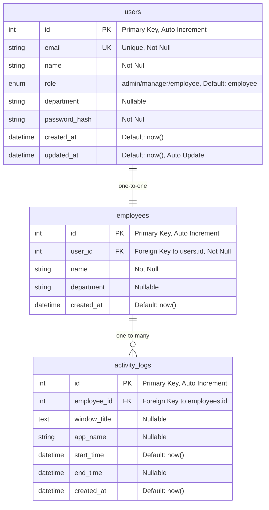

# Схема базы данных проекта Employee Time Tracking

## Диаграмма базы данных



## Подробное описание таблиц

### 1. Таблица `users` (Пользователи системы)

**Назначение**: Хранение учетных записей пользователей системы с аутентификационными данными и ролями.

| Поле | Тип | Ограничения | Описание |
|------|-----|-------------|----------|
| `id` | INTEGER | PRIMARY KEY, AUTO_INCREMENT | Уникальный идентификатор пользователя |
| `email` | STRING | UNIQUE, NOT NULL, INDEX | Email адрес (используется как логин) |
| `name` | STRING | NOT NULL | Полное имя пользователя |
| `role` | ENUM | NOT NULL, DEFAULT 'employee' | Роль: admin, manager, employee |
| `department` | STRING | NULLABLE | Отдел/подразделение |
| `password_hash` | STRING | NOT NULL | Хешированный пароль (bcrypt) |
| `created_at` | DATETIME | DEFAULT now() | Дата создания записи |
| `updated_at` | DATETIME | DEFAULT now(), ON UPDATE now() | Дата последнего обновления |

**Индексы**:
- PRIMARY KEY на `id`
- UNIQUE INDEX на `email`

**Роли пользователей**:
- `admin` - Полный доступ ко всем функциям системы
- `manager` - Доступ к отчетам и статистике сотрудников
- `employee` - Базовый доступ к отслеживанию собственной активности

### 2. Таблица `employees` (Сотрудники)

**Назначение**: Профили сотрудников для отслеживания рабочей активности.

| Поле | Тип | Ограничения | Описание |
|------|-----|-------------|----------|
| `id` | INTEGER | PRIMARY KEY, AUTO_INCREMENT | Уникальный идентификатор сотрудника |
| `user_id` | INTEGER | FOREIGN KEY, NOT NULL | Связь с таблицей users |
| `name` | STRING | NOT NULL | Имя сотрудника |
| `department` | STRING | NULLABLE | Отдел сотрудника |
| `created_at` | DATETIME | DEFAULT now() | Дата создания профиля |

**Связи**:
- `user_id` → `users.id` (ONE-TO-ONE)

**Индексы**:
- PRIMARY KEY на `id`
- FOREIGN KEY INDEX на `user_id`

### 3. Таблица `activity_logs` (Журнал активности)

**Назначение**: Детальное логирование рабочей активности сотрудников.

| Поле | Тип | Ограничения | Описание |
|------|-----|-------------|----------|
| `id` | INTEGER | PRIMARY KEY, AUTO_INCREMENT | Уникальный идентификатор записи |
| `employee_id` | INTEGER | FOREIGN KEY | Связь с таблицей employees |
| `window_title` | TEXT | NULLABLE | Заголовок активного окна |
| `app_name` | STRING | NULLABLE | Название приложения |
| `start_time` | DATETIME | DEFAULT now() | Время начала активности |
| `end_time` | DATETIME | NULLABLE | Время окончания активности |
| `created_at` | DATETIME | DEFAULT now() | Время создания записи |

**Связи**:
- `employee_id` → `employees.id` (MANY-TO-ONE)

**Индексы**:
- PRIMARY KEY на `id`
- INDEX на `employee_id`
- INDEX на `start_time` (для быстрых запросов по времени)
- COMPOSITE INDEX на `(employee_id, start_time)` (для отчетов)

## Связи между таблицами

### 1. users ↔ employees (Один к одному)
```sql
users.id = employees.user_id
```
- Каждый пользователь имеет ровно один профиль сотрудника
- Каждый профиль сотрудника принадлежит одному пользователю
- При удалении пользователя должен удаляться связанный профиль сотрудника

### 2. employees ↔ activity_logs (Один ко многим)
```sql
employees.id = activity_logs.employee_id
```
- Один сотрудник может иметь множество записей активности
- Каждая запись активности принадлежит одному сотруднику
- При удалении сотрудника все его записи активности должны быть удалены

## Бизнес-логика и ограничения

### Ограничения целостности данных

1. **Уникальность email**: Каждый email может быть зарегистрирован только один раз
2. **Обязательные поля**: name, email, password_hash в users; name в employees
3. **Валидация ролей**: Только допустимые значения enum для role
4. **Временные ограничения**: end_time должно быть больше start_time в activity_logs

### Каскадные операции

```sql
-- При удалении пользователя
DELETE FROM users WHERE id = ?
-- Автоматически удаляется связанный employee
-- Автоматически удаляются все activity_logs этого employee

-- При удалении сотрудника
DELETE FROM employees WHERE id = ?
-- Автоматически удаляются все activity_logs этого сотрудника
```

## Примеры SQL запросов

### Создание таблиц

```sql
-- Создание таблицы пользователей
CREATE TABLE users (
    id SERIAL PRIMARY KEY,
    email VARCHAR(255) UNIQUE NOT NULL,
    name VARCHAR(255) NOT NULL,
    role VARCHAR(20) NOT NULL DEFAULT 'employee' 
        CHECK (role IN ('admin', 'manager', 'employee')),
    department VARCHAR(255),
    password_hash VARCHAR(255) NOT NULL,
    created_at TIMESTAMP DEFAULT CURRENT_TIMESTAMP,
    updated_at TIMESTAMP DEFAULT CURRENT_TIMESTAMP
);

-- Создание таблицы сотрудников
CREATE TABLE employees (
    id SERIAL PRIMARY KEY,
    user_id INTEGER NOT NULL REFERENCES users(id) ON DELETE CASCADE,
    name VARCHAR(255) NOT NULL,
    department VARCHAR(255),
    created_at TIMESTAMP DEFAULT CURRENT_TIMESTAMP
);

-- Создание таблицы логов активности
CREATE TABLE activity_logs (
    id SERIAL PRIMARY KEY,
    employee_id INTEGER REFERENCES employees(id) ON DELETE CASCADE,
    window_title TEXT,
    app_name VARCHAR(255),
    start_time TIMESTAMP DEFAULT CURRENT_TIMESTAMP,
    end_time TIMESTAMP,
    created_at TIMESTAMP DEFAULT CURRENT_TIMESTAMP
);
```

### Создание индексов

```sql
-- Индексы для оптимизации запросов
CREATE INDEX idx_employees_user_id ON employees(user_id);
CREATE INDEX idx_activity_logs_employee_id ON activity_logs(employee_id);
CREATE INDEX idx_activity_logs_start_time ON activity_logs(start_time);
CREATE INDEX idx_activity_logs_employee_time ON activity_logs(employee_id, start_time);
CREATE INDEX idx_users_email ON users(email);
```

### Примеры запросов для отчетов

```sql
-- Получение активности сотрудника за период
SELECT 
    al.app_name,
    al.window_title,
    al.start_time,
    al.end_time,
    EXTRACT(EPOCH FROM (al.end_time - al.start_time))/60 as duration_minutes
FROM activity_logs al
JOIN employees e ON al.employee_id = e.id
WHERE e.id = ? 
    AND al.start_time >= ? 
    AND al.start_time <= ?
    AND al.end_time IS NOT NULL
ORDER BY al.start_time;

-- Статистика по отделам
SELECT 
    e.department,
    COUNT(DISTINCT e.id) as employee_count,
    SUM(EXTRACT(EPOCH FROM (al.end_time - al.start_time))/3600) as total_hours
FROM employees e
LEFT JOIN activity_logs al ON e.id = al.employee_id
WHERE al.start_time >= ? AND al.start_time <= ?
    AND al.end_time IS NOT NULL
GROUP BY e.department;
```

## Особенности реализации

### 1. Безопасность
- Пароли хранятся в виде bcrypt хешей
- Роли определяют уровень доступа к данным
- Внешние ключи обеспечивают целостность данных

### 2. Производительность
- Составные индексы для частых запросов по сотруднику и времени
- Партиционирование activity_logs по времени (рекомендуется для больших объемов)

### 3. Масштабируемость
- Возможность добавления новых полей без нарушения существующей структуры
- Гибкая система ролей для расширения функционала

### 4. Аудит и мониторинг
- Поля created_at и updated_at для отслеживания изменений
- Возможность добавления таблицы audit_log для детального аудита

Эта схема обеспечивает надежное хранение данных о пользователях, сотрудниках и их рабочей активности с возможностью генерации подробных отчетов и статистики.
