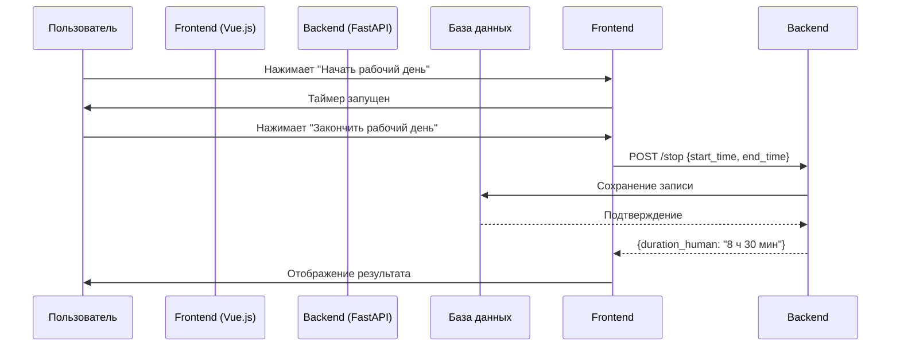

```mermaid
sequenceDiagram
    participant Пользователь
    participant Frontend (Vue.js)
    participant Backend (FastAPI)
    participant База данных

    Пользователь->>Frontend: Нажимает "Начать рабочий день"
    Frontend->>Пользователь: Таймер запущен
    Пользователь->>Frontend: Нажимает "Закончить рабочий день"
    Frontend->>Backend: POST /stop {start_time, end_time}
    Backend->>База данных: Сохранение записи
    База данных-->>Backend: Подтверждение
    Backend-->>Frontend: {duration_human: "8 ч 30 мин"}
    Frontend->>Пользователь: Отображение результата
```
