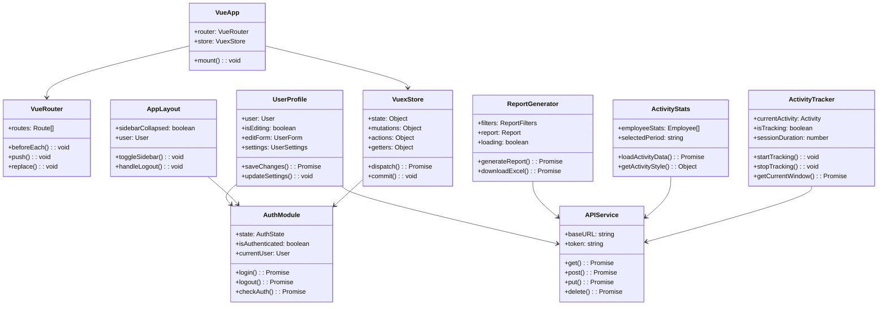
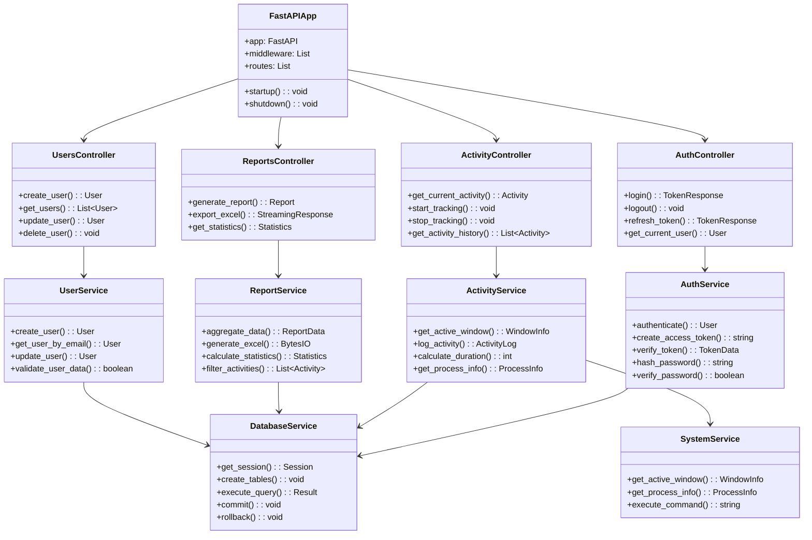
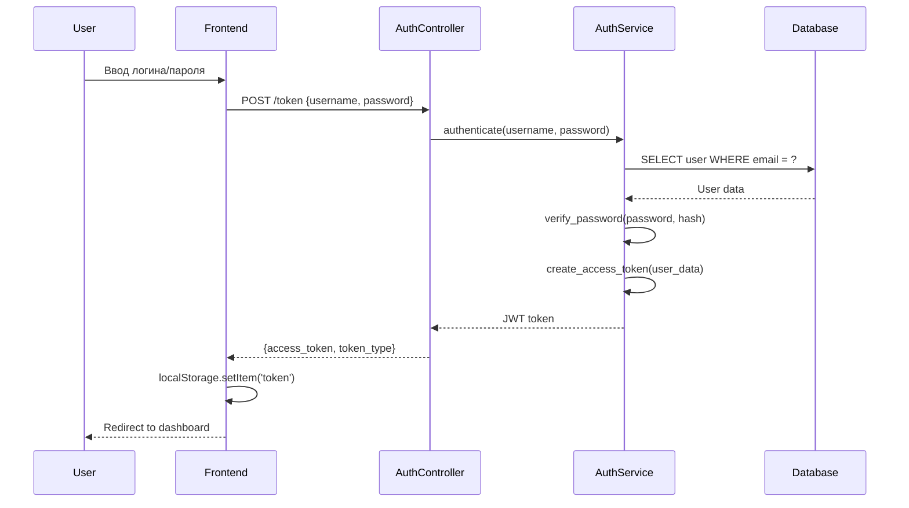
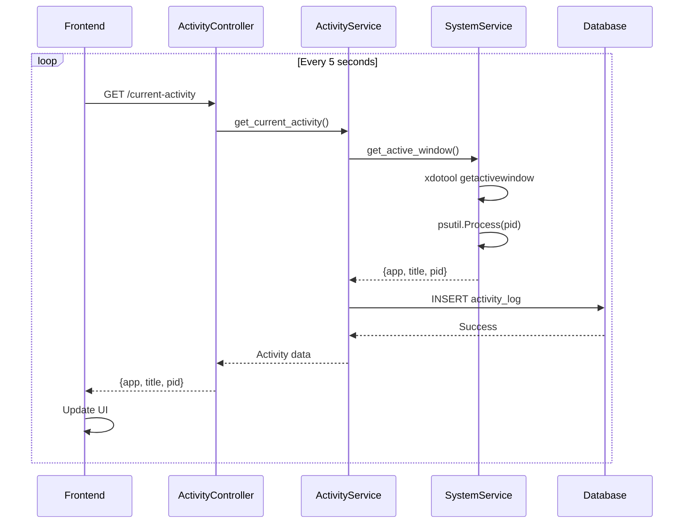
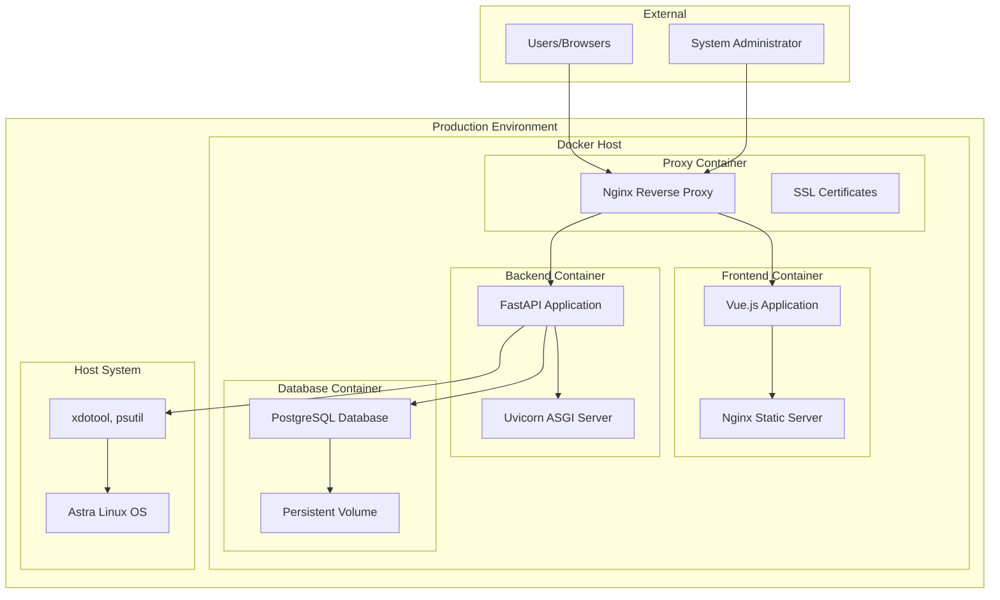
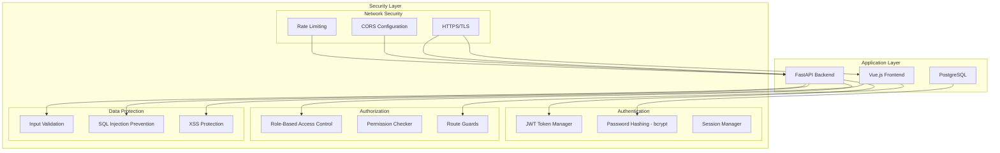
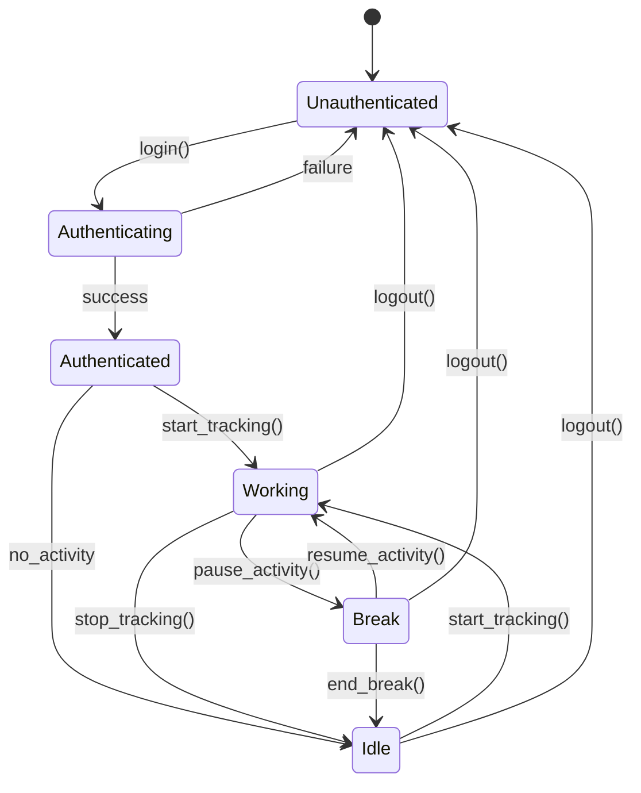
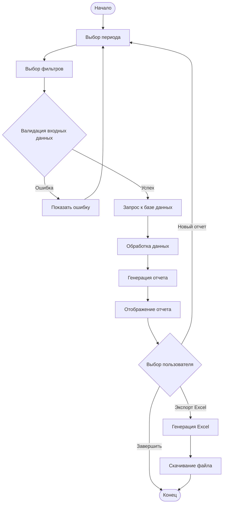

# Архитектурная UML-диаграмма системы Employee Time Tracking

## 1. Общая архитектура системы (Component Diagram)

```mermaid
graph TB
    subgraph "Client Layer"
        Browser[Web Browser]
        Mobile[Mobile Device]
    end

    subgraph "Presentation Layer"
        subgraph "Vue.js Frontend"
            Router[Vue Router]
            Store[Vuex Store]
            Components[Vue Components]
            Services[API Services]
        end
    end

    subgraph "Infrastructure Layer"
        Nginx[Nginx Reverse Proxy]
        Docker[Docker Containers]
    end

    subgraph "Application Layer"
        subgraph "FastAPI Backend"
            AuthAPI[Authentication API]
            ActivityAPI[Activity Tracking API]
            ReportsAPI[Reports API]
            UsersAPI[Users Management API]
            Middleware[JWT Middleware]
        end
    end

    subgraph "Data Layer"
        PostgreSQL[(PostgreSQL Database)]
        Redis[(Redis Cache)]
    end

    subgraph "System Layer"
        Linux[Linux OS / Astra Linux]
        SystemAPIs[System APIs - xdotool, psutil]
    end

    Browser --> Nginx
    Mobile --> Nginx
    Nginx --> Router
    Router --> Store
    Store --> Components
    Components --> Services
    Services --> AuthAPI
    Services --> ActivityAPI
    Services --> ReportsAPI
    Services --> UsersAPI
    
    AuthAPI --> Middleware
    ActivityAPI --> Middleware
    ReportsAPI --> Middleware
    UsersAPI --> Middleware
    
    Middleware --> PostgreSQL
    ActivityAPI --> SystemAPIs
    SystemAPIs --> Linux
    
    AuthAPI --> Redis
    
    Docker -.-> "Vue.js Frontend"
    Docker -.-> "FastAPI Backend"
    Docker -.-> PostgreSQL
```

## 2. Диаграмма классов Frontend (Class Diagram)



## 3. Диаграмма классов Backend (Class Diagram)



## 4. Диаграмма моделей данных (Class Diagram)

```mermaid
classDiagram
    class User {
        +id: int
        +email: string
        +name: string
        +role: UserRole
        +department: string
        +password_hash: string
        +created_at: datetime
        +updated_at: datetime
        +verify_password(): boolean
        +to_dict(): dict
    }

    class Employee {
        +id: int
        +user_id: int
        +name: string
        +department: string
        +created_at: datetime
        +user: User
        +activity_logs: List~ActivityLog~
        +get_total_time(): int
        +get_activities_by_date(): List~ActivityLog~
    }

    class ActivityLog {
        +id: int
        +employee_id: int
        +window_title: string
        +app_name: string
        +start_time: datetime
        +end_time: datetime
        +created_at: datetime
        +employee: Employee
        +get_duration(): int
        +is_active(): boolean
    }

    class UserRole {
        <<enumeration>>
        ADMIN
        MANAGER
        EMPLOYEE
    }

    class TokenData {
        +sub: string
        +exp: datetime
        +iat: datetime
    }

    class ReportData {
        +items: List~EmployeeReport~
        +total_department_time: int
        +average_employee_time: int
        +period_start: datetime
        +period_end: datetime
    }

    class EmployeeReport {
        +employee_id: int
        +employee_name: string
        +department: string
        +total_time: int
        +active_time: int
        +apps: dict
        +productivity: float
    }

    User ||--|| Employee : "one-to-one"
    Employee ||--o{ ActivityLog : "one-to-many"
    User --> UserRole
    ReportData --> EmployeeReport
```

## 5. Диаграмма последовательности - Аутентификация (Sequence Diagram)



## 6. Диаграмма последовательности - Отслеживание активности (Sequence Diagram)



## 7. Диаграмма развертывания (Deployment Diagram)



## 8. Диаграмма компонентов безопасности (Component Diagram)



## 9. Диаграмма состояний пользователя (State Diagram)



## 10. Диаграмма активности - Генерация отчета (Activity Diagram)



## Заключение

Данная архитектурная UML-диаграмма отражает:

1. **Многослойную архитектуру** с четким разделением ответственности
2. **Микросервисный подход** с независимыми компонентами
3. **Безопасность на всех уровнях** с JWT, RBAC и защитой данных
4. **Масштабируемость** через Docker-контейнеризацию
5. **Интеграцию с системными API** для мониторинга активности
6. **Современные технологии** Vue.js, FastAPI, PostgreSQL
7. **Детальную проработку** бизнес-логики и потоков данных

Архитектура обеспечивает надежную, безопасную и производительную систему учета рабочего времени, соответствующую современным стандартам разработки корпоративных приложений.
