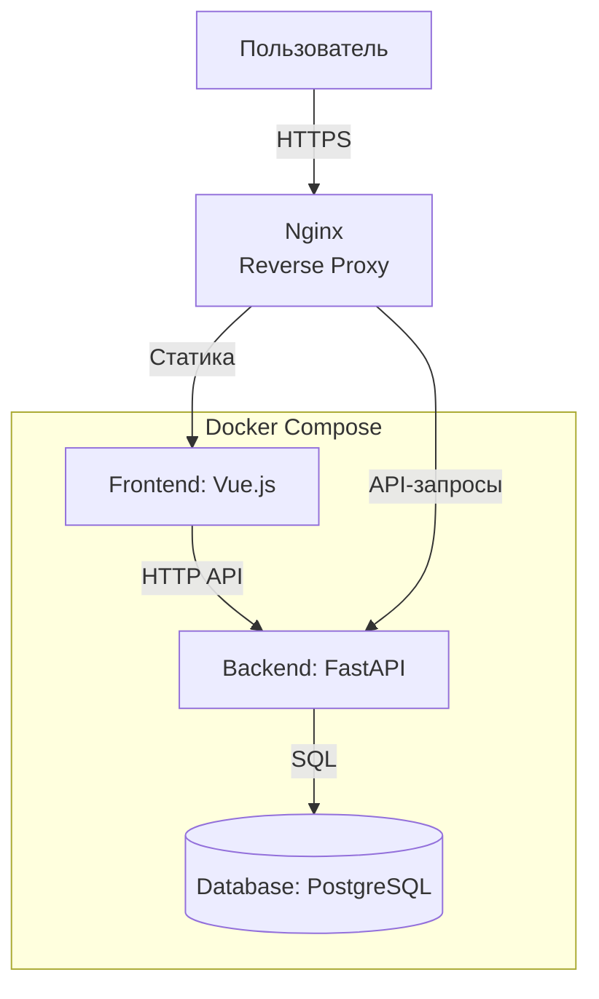

```mermaid
flowchart TB
    subgraph Docker-Compose["Docker Compose"]
        A[Frontend: Vue.js] -->|HTTP API| B[Backend: FastAPI]
        B -->|SQL| C[(Database: PostgreSQL)]
    end
    
    User[Пользователь] -->|HTTPS| Nginx
    Nginx[Nginx\nReverse Proxy] -->|Статика| A
    Nginx -->|API-запросы| B
```
