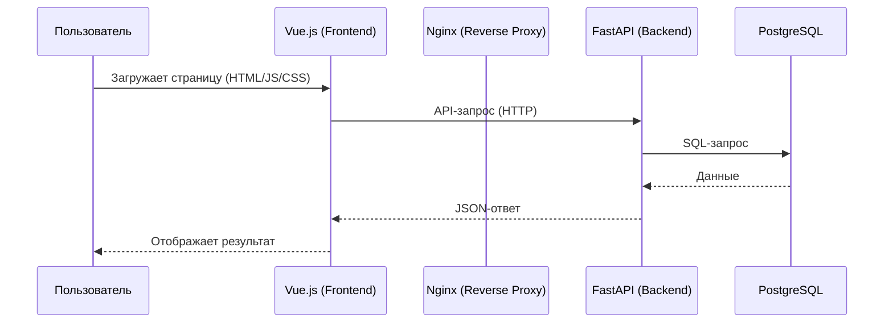

```mermaid
sequenceDiagram
    participant User as Пользователь
    participant Frontend as Vue.js (Frontend)
    participant Nginx as Nginx (Reverse Proxy)
    participant Backend as FastAPI (Backend)
    participant DB as PostgreSQL

    User->>Frontend: Загружает страницу (HTML/JS/CSS)
    Frontend->>Backend: API-запрос (HTTP)
    Backend->>DB: SQL-запрос
    DB-->>Backend: Данные
    Backend-->>Frontend: JSON-ответ
    Frontend-->>User: Отображает результат
```
